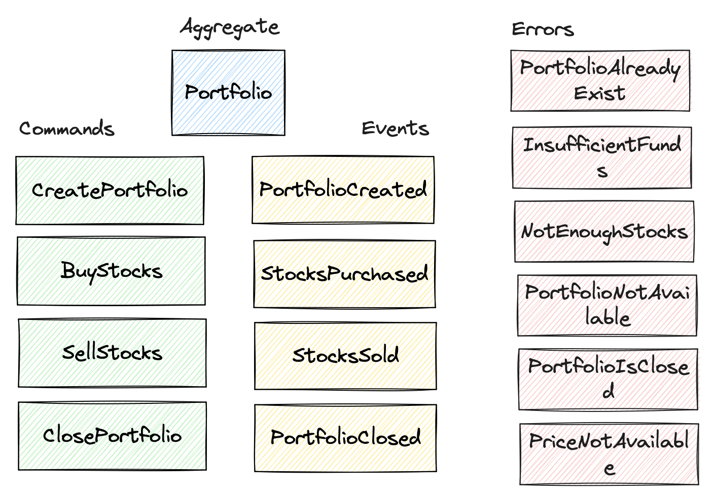

# Functional Event-Sourcing in Kotlin

A toy project to explore the capabilities of functional event-sourcing using Kotlin

## User Stories

The project try to implement the following user stories. The domain is a simplified stock trading system.

- [x] A user should create a new portfolio.
- [x] A user should buy stocks for an existing portfolio.
- [x] A user should sell stocks that it owns.
- [x] A user should close a portfolio.

## Event Storming / Domain Modeling

The following diagram shows the domain model of the system. The model is based on the user stories above.

## Technology Stack

The project uses the following technologies:

- Kotlin
- [Arrow Kt](https://arrow-kt.io/)
- [Ktor](https://ktor.io/)
- [EventStoreDB](https://eventstore.com/)
- [SQLDelight](https://cashapp.github.io/sqldelight/)
- [Kotest](https://kotest.io/)
- [Testcontainers](https://www.testcontainers.org/)
- [Mockk](https://mockk.io/)
- [Ktlint](https://ktlint.github.io/)

## References

The project is heavily inspired by the following resources:

- [Functional Event Sourcing Decider](https://thinkbeforecoding.com/post/2021/12/17/functional-event-sourcing-decider) by Jeremie Chassaing
- [Event sourcing Series' Articles](https://dev.to/jakub_zalas/series/25345) by Jakub Zalas

